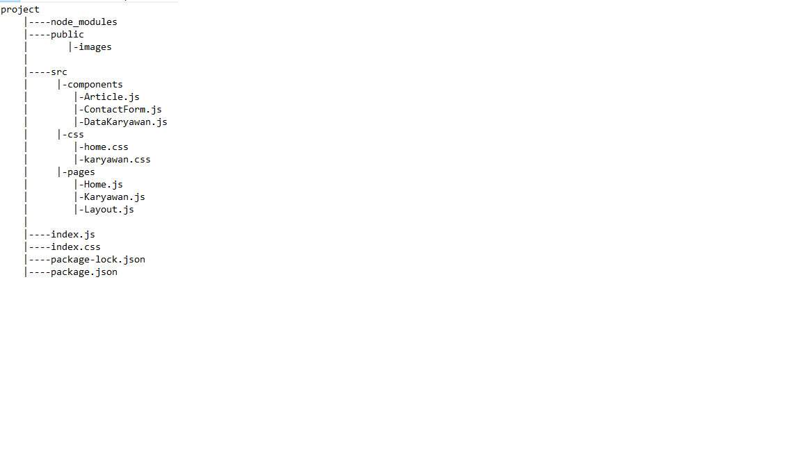

# fullstack-dev-idsolutions

### UIkit Frontend Framework

## how to run
##### type npm install in terminal then simply type npm start.

#### Home.js berisikan Slider, Daftar Artikel, Gallery, Form Contact dan About me
#### Karyawan.js berisikan table dengan 10 data dummy, dan tombol detail untuk mengarahkan ke Detail Karyawan
